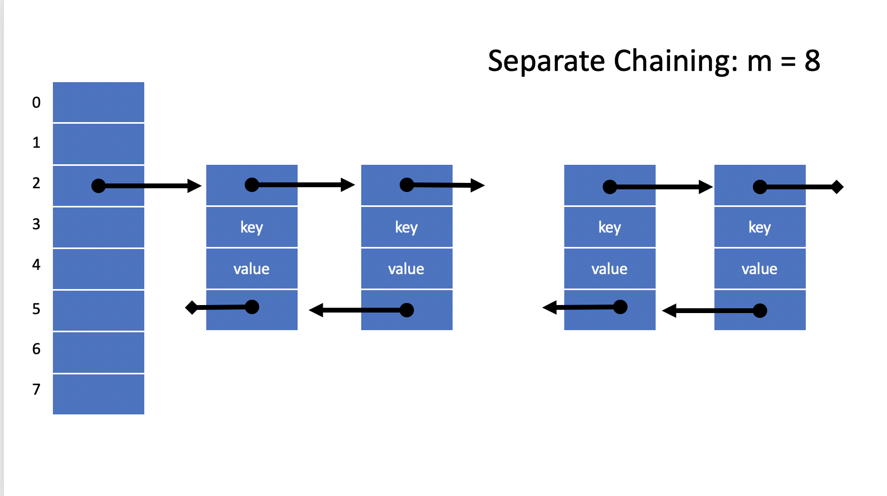
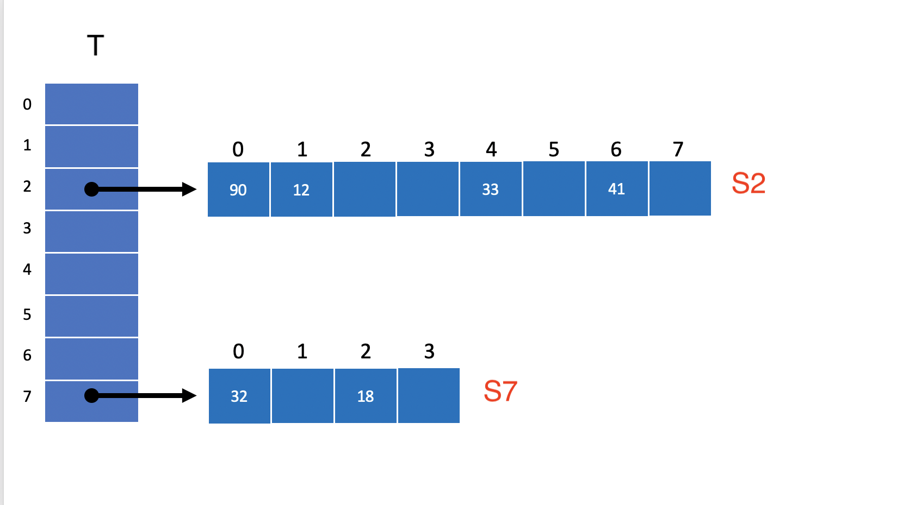
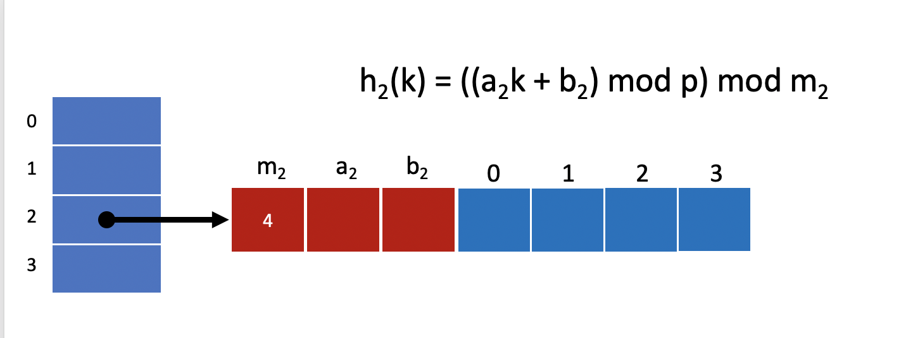

# CSCI 1102 Computer Science 2

### Spring 2021

##### Instructor R. Muller

Boston College

---

## Problem Set 9: Final Project

### 18 Points

### Due Friday May 7, 2021, midnight.

Though we will accept this problem set without late penalty up until Monday May 10, midnight.

This is a pair problem set, feel free to work with one partner.

> NOTE: This readme file uses some latex source to format some mathematical notation. For proper rendering, view the companion file README.pdf instead of this markdown file.

---

There are 2 options for this problem set.

## Option 1: Biksemad Hash Tables

> For this option, you're encouraged to borrow as much code as you like from either or both of the [SeparateChainingHashSt.java](https://algs4.cs.princeton.edu/code/edu/princeton/cs/algs4/SeparateChainingHashST.java.html) and [LinearProbingHashST.java](https://algs4.cs.princeton.edu/code/edu/princeton/cs/algs4/LinearProbingHashST.java.html) implementations that are distributed on the booksite.

Hash tables have excellent average case performance but the worst case performance can sometimes be poor. In this option you'll develop a variation of separate chaining called Biksemad Hashing: instead of using [separate chaining](https://en.wikipedia.org/wiki/Hash_table#Separate_chaining) with a linked-list of entries for each hash table entry:



In Biksemad Hashing, the linked list is replaced with a second hash table:



In this setup, *two* hash tables are involved with each operation: the primary table $T$ running vertically, and then a secondary hash table $S_i$, one for each each slot $i$ in the primary table. When two keys map to the same table index they are said to have *collided*. In the example, the keys 90, 12, 33 and 41 collided at location 2 in the primary (vertical) table $T$. But each of these keys hashed to a unique location in the secondary (horizontal) table $S_2$.

+ The primary table is similar to a [separate chaining](https://en.wikipedia.org/wiki/Hash_table#Separate_chaining) table, the main difference is that the items in the table entries are hash tables rather than linked-lists of nodes. See e.g., [SeparateChainingHashSt.java](https://algs4.cs.princeton.edu/code/edu/princeton/cs/algs4/SeparateChainingHashST.java.html).
+ Each secondary table should be an [open addressing](https://en.wikipedia.org/wiki/Open_addressing) table. Feel free to use any probing method, [linear probing]() would be a natural choice, see e.g., [LinearProbingHashST.java](https://algs4.cs.princeton.edu/code/edu/princeton/cs/algs4/LinearProbingHashST.java.html).

#### The ADT

The problem is to implement the following Map ADT using two-level hashing.

```java
public interface Map<Key, Value> {
  boolean isEmpty();
  int size();
  void put(Key key, Value value);
  Value get(Key key);
  boolean contains(Key key);
  String toString();
  int collisions();                    // returns the total number of collisions in all secondary tables
}
```

#### Hash Functions

>  In the discussion that follows, we'll treat hash table *keys* as non-negative integers. In Java, keys of any type can be mapped to non-negative integers using the technique suggested in Sedgewick and Wayne:
>
> ```java
> (key.hashCode() & 0x7fffffff)
> ```

If the same hash function used for the primary table was used again in each of the secondary tables then keys that collided in the primary table would likely collide again in the secondary table. It turns out that we can arrange for a low probability of collision in the secondary tables by carefully coordinating the designs of one hash function for the primary table and separate hash functions for each of the secondary tables.

All hash functions will be of the general form $h(k) = ((ak + b)\ \mathrm{mod}\ p)\ \mathrm{mod}\ m$, where 

+ $m$ is the table size (in the vertical example above, $m = 8$), 
+ $p$ is a prime number larger than any key, 
+ $a$ is a randomly chosen integer constant in the range $1, \ldots, p - 1$ and 
+ $b$ is a randomly chosen integer constant in the range $0, \ldots, p - 1$.

> If you're interested in the mathematical details about such hash functions, you can read about them [here](https://en.wikipedia.org/wiki/Universal_hashing).

The prime number $p$ can be chosen arbitrarily once and for all, [look one up](http://compoasso.free.fr/primelistweb/page/prime/liste_online_en.php) and define it in your program as an integer constant. We can ensure that $p$ is larger than any key by mapping every key to the range 0 .. p - 1 as shown in the Java code below. Once you've chosen $p$, the integer constants $a$ and $b$ can be chosen randomly using our old friend, the `StdRandom.uniform` function.

In Java, one might write the general form of this hashing function as

```java
int hash(Key key, int a, int b, int m) {
  int k = (key.hashCode() & 0x7FFFFFFF) % this.p;    // Convert the key to an integer in the range 0 .. p-1
  return (((a * k) + b) % this.p) % m;
}
```

where `this.p` is an instance variable containing the chosen prime number.

### Starting Up

The first order of business is to define the global prime number $p$ that will be used in all of the hashing. This number should be recorded in a constant or variable that is visible globally throughout your program. Then, following the lead of Sedgewick and Wayne in [SeparateChainingHashSt.java](https://algs4.cs.princeton.edu/code/edu/princeton/cs/algs4/SeparateChainingHashST.java.html), it would be reasonable to start things off with an empty primary hash table of size, say $m = 4$:

 

Having defined $p$ and chosen a table size $m = 4$ for the primary table, the startup code should then compute the random integer constants $a$ and $b$ used in the hash function for the primary table. These integers can be computed using `StdRandom.uniform`. Once these items have been defined, we'll be able to compute hashes into the primary table by calling the above defined `hash` function.

#### Creating Secondary Tables

When the first `put(key, value)` occurs, the hash $i$ into the primary table can be computed by calling the above defined `hash` function. Finding that the $i$th entry of the primary table is an empty secondary table, the `put` function should create a fresh secondary table $S_i$. Feel free to follow the lead in [LinearProbingHashST.java](https://algs4.cs.princeton.edu/code/edu/princeton/cs/algs4/LinearProbingHashST.java.html) in creating initial secondary tables of size $m = 4$.



In order to use the freshly created secondary table $S_i$, you'll have to finish preparing the ingredients for its hashing function. The global prime number $p$ has already been created and should be available, say, in an instance variable `this.p`. We've already chosen a size $m_i = 4$ for this secondary table, so all that remains is to choose the random integer constants for this table $a_i$ and $b_i$. These can be computed using `StdRandom.uniform`. 

> Note that the randomly chosen constants $a_i$ and $b_i$ for the secondary table are very unlikely to be the same as the randomly chosen $a$ and $b$ used in the hash function used in the primary table.

Once these items are all in place, we can compute hashes into secondary table $S_i$ by calling the general `hash` function defined above with the appropriate inputs.

In addition to the table size $m_i$ and the constants $a_i$ and $b_i$, each secondary table $S_i$ should also have an integer variable $n_i$ recording the number of keys in $S_i$ and an integer variable for recording the number of collisions that have occurred since $S_i$ was created. The secondary hash tables should also have a serviceable `toString` function.

#### Inserting into an Existing Secondary Table

If the primary hash index $i$ arising in a `put(key, value)` finds a non-empty secondary table $S_i$, then the items required to compute the secondary hash into $S_i$ should already be in place. That is, the table size $m_i$ and the constants $a_i$ and $b_i$ were created when $S_i$ was created. The hash into the secondary table $S_i$ can be computed by calling the same general `hash` function with the appropriate inputs. This hash may or may not lead to a collision in $S_i$, if it does, increment the collision counter for $S_i$. 

#### Resizing

If the [load factor](https://en.wikipedia.org/wiki/Hash_table#Key_statistics) $\alpha_i = n_i/m_i$ of secondary table $S_i$ becomes unfavorable the table $S_i$ should be resized.  Remember that a load factor is generally unfavorable if the table is too crowded (i.e., $n_i / m_i \ge 1 / 2$) which leads to collisions and clustering. Or if $S_i$ is too sparse (i.e., $n_i / m_i \le 1/8$) it has wasted table space. Note that the code for taking care of resizing the secondary tables is already defined in [LinearProbingHashST.java](https://algs4.cs.princeton.edu/code/edu/princeton/cs/algs4/LinearProbingHashST.java.html), feel free to use it off the shelf. Note that when resizing occurs, the table size $m_i$ will need to be updated but the constants $a_i$ and $b_i$ for table $S_i$ can remain the same.

Resizing of the primary table $T$ is extra credit, see below.

#### What is Required

Implement the two-level Biksemad Hash ADT in a file called `TwoLevelHashC.java`.  Your implementing class should include a constructor that accepts a path to a text file containing strings, one per line, that can be used as keys. The constructor should open the file, read all of the keys and insert the keys into an empty hash table. Each key should be given the same simple default value such as  `new Integer(0)`.

Your implementation should include a `main` function for testing correctness and performance. The problem set repo includes a `test/` directory containing four files with string keys. Create a new hash table with the keys in `/test/fiveHundredKeys.txt`.

+ Confirm that the hash table contains all 500 keys by calling the `contains` function for each of the 500 keys in the file;
+ Confirm that the hash table does not contain the key "NOT_A_KEY";
+ Print the total number of collisions that occurred in the insertion of the 500 keys.

---

#### Extra Credit

There are a number of ways to receive extra credit for this option, choose any of these adding up to no more than 6 points.

1. (3 Points) Resize the primary table when its load factor is greater than 1/4 or less than 1/8. When the primary table is resized, all of the secondary tables are invalidated, all keys must be rehashed into the new primary table.

2. (3 Points) Compare the performance of your implementation to that of the [SeparateChainingHashSt.java](https://algs4.cs.princeton.edu/code/edu/princeton/cs/algs4/SeparateChainingHashST.java.html) implementation. In order to do this, create a table with the 100,000 keys in `test/random.txt` and then perform `get`s on all of the 20,000 keys in `test/searchkeys.txt` for both implementations. Use the unix `time` utility as in

   ```bash
   > time java-algs4 TwoLevelHashC test/random.txt test/searchkeys.txt
   > time java-algs4 SeparateChainingHashST test/random.txt test/searchkeys.txt
   ```

   > Note this will require modification of both implementations to accept two command line arguments.

3. (3 Points) Compare the performance of your implementation to that of the [RedBlackBST.java](https://algs4.cs.princeton.edu/33balanced/RedBlackBST.java.html) implementation of balanced search trees. In order to do this, create a table with the 100,000 keys in `test/random.txt` and then perform `get`s on all of the 20,000 keys in `test/searchkeys.txt` for both implementations. Use the unix `time` utility as in

   ```bash
   > time java-algs4 TwoLevelHashC test/random.txt test/searchkeys.txt
   > time java-algs4 RedBlackBST test/random.txt test/searchkeys.txt
   ```

   > Note this will require modification of both implementations to accept two command line arguments.

4. (3 Points) Refine the collision analysis. A collision occurs when the hash $i$ of key $k$ is the index of an already occupied table cell. Let's call the occupying key $k'$. The key $k'$ might be in cell $i$ because it too hashed to $i$, let's call this a *direct collision*. Or it might be that $k'$ hashed to some other location $j$ but cell $j$ was otherwise occupied and $k'$ was placed in cell $i$ in the process of a post-collision linear probe. Let's call this an *indirect collision*.

   Of the collisions that occur in the insertion of 100,000 keys, how many were direct and how many were indirect? You'll have to keep track of another counter.

## Option 2: Immutable Red/Black Trees

In this option, you'll develop an implementation of the following API for immutable Red/Black Trees. If you plan to pursue option 2, please contact the instructor.

```java
public interface OrderedMap<Key extends Comparable<Key>, Value {
  boolean isEmpty();
  int size();
  OrderedMap<Key, Value> put(Key key, Value value);
  Value get(Key key);
  String toString();
}
```

